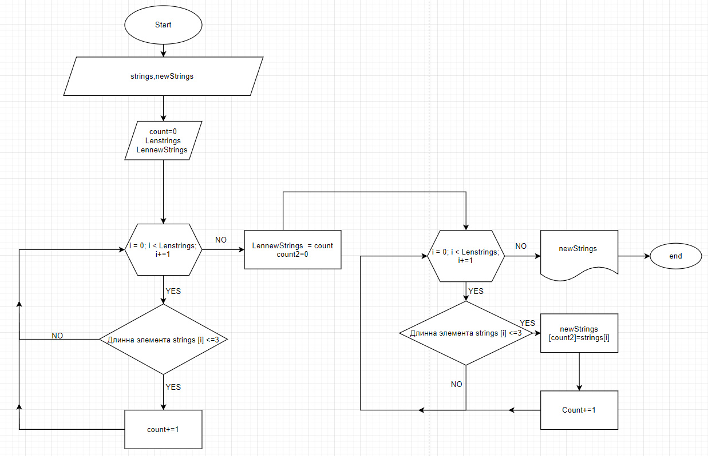

# *Задача:*
 *Написать программу, которая из имеющегося массива строк формирует новый массив из строк, длина которых меньше, либо равна 3 символам. Первоначальный массив можно ввести с клавиатуры, либо задать на старте выполнения алгоритма. При решении не рекомендуется пользоваться коллекциями, лучше обойтись исключительно массивами.*

* *В начеле код принимает массив из строк.*
* *Затем следует метод который вычисляет длинну строк*
* *Затем следует метод который записывает всел строки которые не длинее 3х символов*
* *Затем происходит вывод полученного массива*

